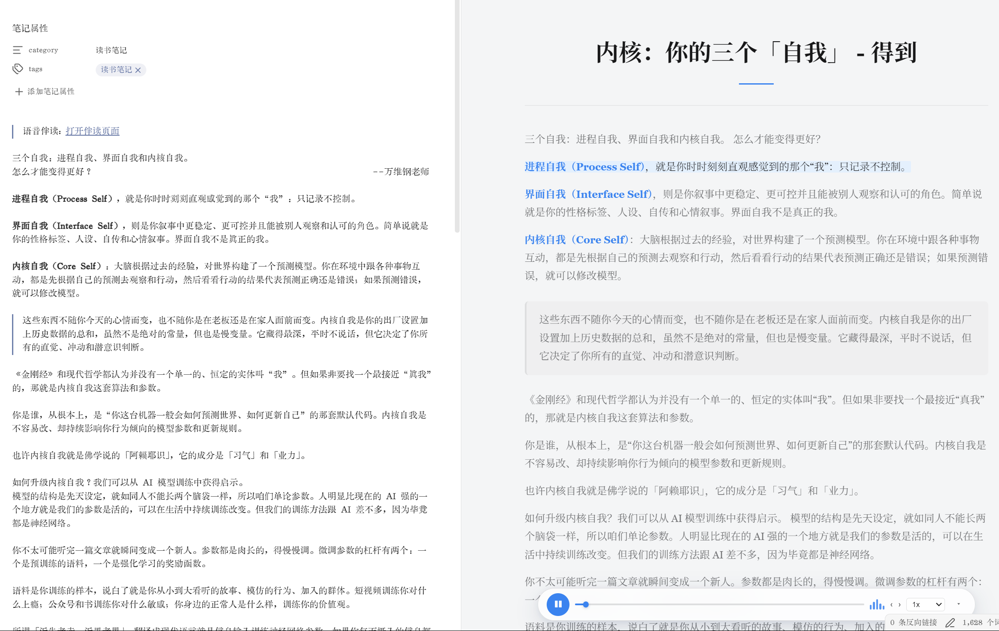
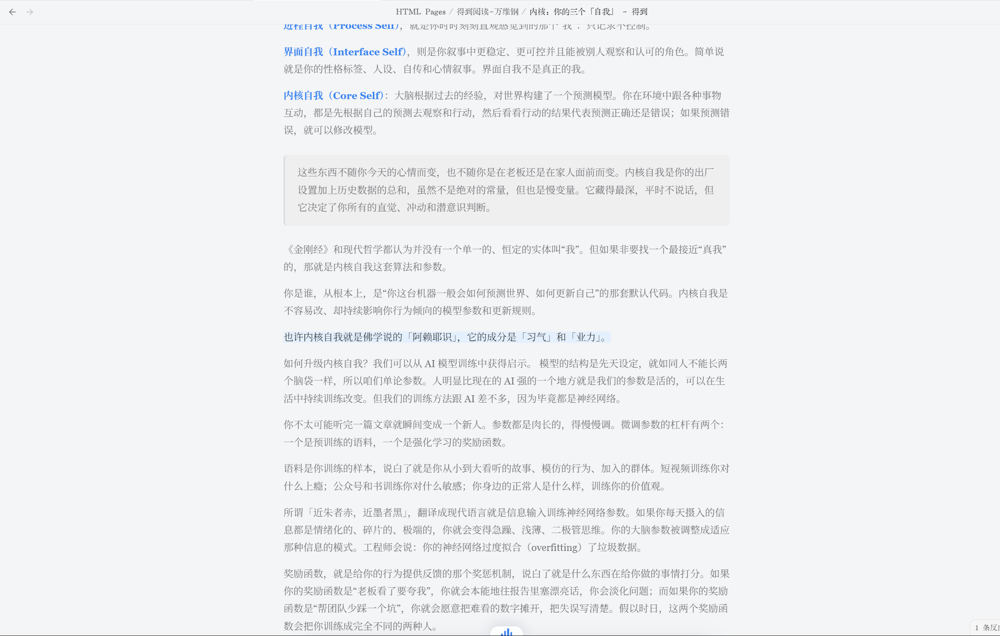

# 语音伴读 - Read Along

语言：中文介绍 / 展开下方 English README

> 本项目基于开源项目 [notes-to-html-pages](https://github.com/afanos/notes-to-html-pages)（作者 Afan，MIT 许可）二次开发，在其之上做了品牌化（语音伴读 / Read Along）与功能扩展（语音伴读、`#` 路径链接修复等）。感谢原作者。

## 中文介绍

**语音伴读 (Read Along)** 是一个 Obsidian 插件：把 Markdown 笔记导出成清晰、可离线阅读的网页，并可选开启「语音伴读」——调用 TTS 把全文**逐句朗读**出来，**读到哪句高亮哪句**，配一个内置播放器（播放 / 暂停 / 倍速 / 上一句下一句 / 进度条）。

它首先是一个**深度阅读导出器**：把拥挤的笔记变成像文章、报告、小册子一样的阅读页；再加上**语音伴读**，让长文可以「边听边读」。

导出的 `.html` 完全自包含（内联 CSS、可选内嵌图片与音频），不依赖外部网络，可以直接双击打开，也能在 Obsidian 文件列表里直接点开阅读。

它特别适合这些场景：

- 把长笔记、调研文档、年度总结、深度文章导出成更舒服的阅读版；
- 长文「听读」：通勤、护眼，或想换种方式再过一遍内容；
- 自动生成可点击目录，长文里快速跳转；
- 保留清晰的标题层级、引用块、重点提示、结论卡片、表格和 ASCII 图；
- 纯 CSS 与内联资源，离线也能阅读和分享；
- 在 Obsidian 内直接识别并打开 `.html` 文件，不用离开知识库；
- 插件菜单和设置页支持中文 / English 切换；
- 当前版本优先支持 Obsidian 桌面端。

> ⚠️ 语音伴读功能需要你**自己的火山引擎（Volcengine）语音合成 API Key**；不开启语音伴读时全程本地、不联网。详见下方「隐私」。

## 效果预览





<details>
<summary>English README</summary>

**Read Along (语音伴读)** is an Obsidian plugin: it exports Markdown notes into clean, offline-readable web pages, and can optionally narrate the whole note sentence-by-sentence (TTS) with the current sentence highlighted as it plays, driven by a small built-in player (play/pause, speed, previous/next sentence, progress).

At its core it is a **deep-reading exporter** that turns crowded notes into article-like reading pages; Read Along adds "listen while you read" on top.

Exported `.html` is fully self-contained (inline CSS, optional inline images and audio) and needs no network at read time — double-click to open, or read it inside Obsidian.

## Features

- **Read Along (optional):** synthesizes the note sentence-by-sentence via TTS and embeds the audio into the exported page, with a floating player (play/pause, speed, prev/next sentence, progress bar) and sentence highlighting synced to playback.
- Exports the current note or a whole folder to self-contained `.html` (inline CSS, optional inline images/audio, no read-time network dependency).
- Clean reading layout: narrow body, serif typography, clear headings, a clickable table of contents, tables, code blocks, blockquotes, highlighted notes, conclusion callouts, and ASCII-diagram blocks.
- Registers an in-app `.html` reader so exported pages open straight from the file explorer.
- Optionally inserts a tidy back-link at the top of the source note — and it resolves correctly even when the export path contains `#`.
- Preserves folder structure, converts wiki-links to same-name HTML pages, and embeds local images as data URIs (all optional).
- Chinese / English UI. Desktop-first.

## Install Manually

1. Download the release assets:
   - `main.js`
   - `manifest.json`
2. Create this folder inside your vault:

```text
.obsidian/plugins/notes-to-html-pages/
```

3. Put `main.js` and `manifest.json` in that folder.
4. Reload Obsidian.
5. Enable `语音伴读` (Read Along) in Community plugins.

## Use

Export the current note:

```text
语音伴读: 导出当前笔记为语音伴读页面
```

You can also right-click a Markdown file or folder in the file explorer and choose the export command. Exported files are saved to `HTML Pages/` by default.

To enable **Read Along**, open the plugin settings, turn on **语音合成 (TTS)**, paste your Volcengine speech-synthesis API key, and pick a voice. The next export then bakes the per-sentence audio and synced highlighting into the page.

The settings also let you change the export folder, style preset, folder-structure behavior, wiki-link conversion, image embedding, in-app HTML reading, launcher-note generation, and source-note back-link insertion.

## Privacy

The HTML export itself runs entirely **locally** — your note content is never uploaded for the page conversion.

**Read Along is the one exception:** when TTS is enabled, the note's sentences are sent to Volcengine's (火山引擎) speech-synthesis API using *your own* API key, and the returned audio is embedded into the exported page. Leave Read Along off and nothing ever leaves your vault.

## Development

```bash
npm install
npm run build
```

The production build writes `main.js` to the repository root.

## Release

For Obsidian community releases, the GitHub release tag must exactly match the version in `manifest.json`, without a `v` prefix. The release assets must include `main.js` and `manifest.json` as separate files.

## Credits & License

Based on the open-source project [notes-to-html-pages](https://github.com/afanos/notes-to-html-pages) by Afan (MIT). The original copyright notice is retained in `LICENSE`; this fork adds the Read Along (语音伴读) branding and features.

MIT.

</details>
