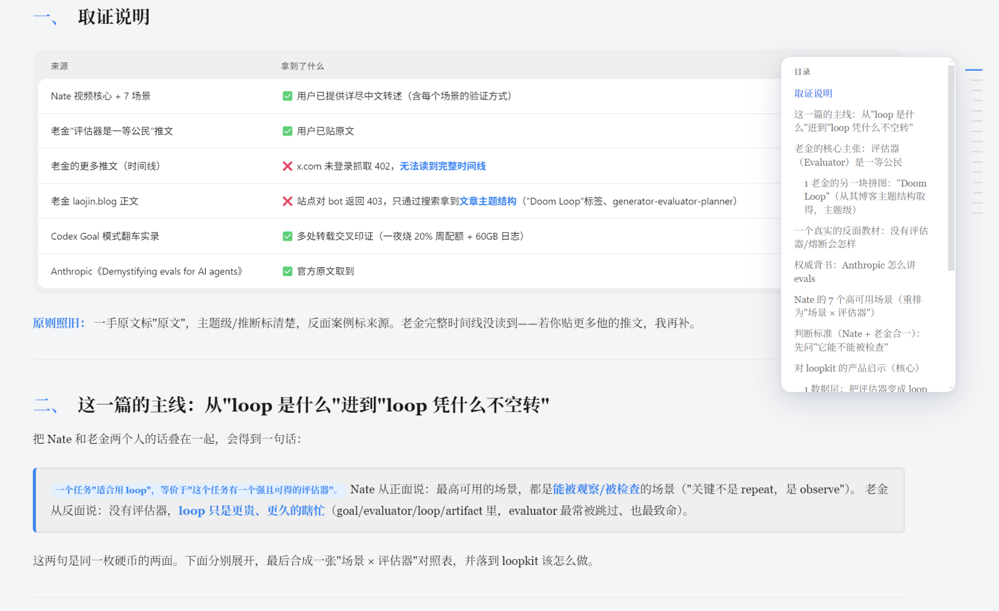
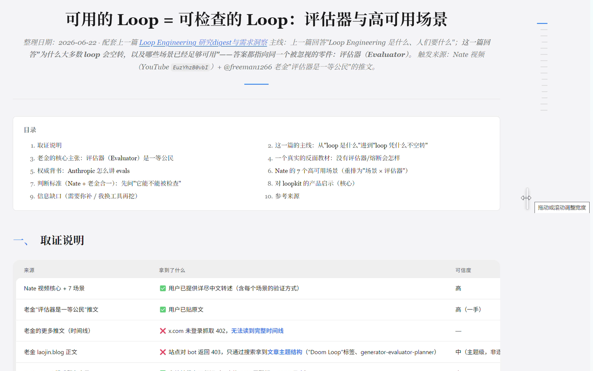
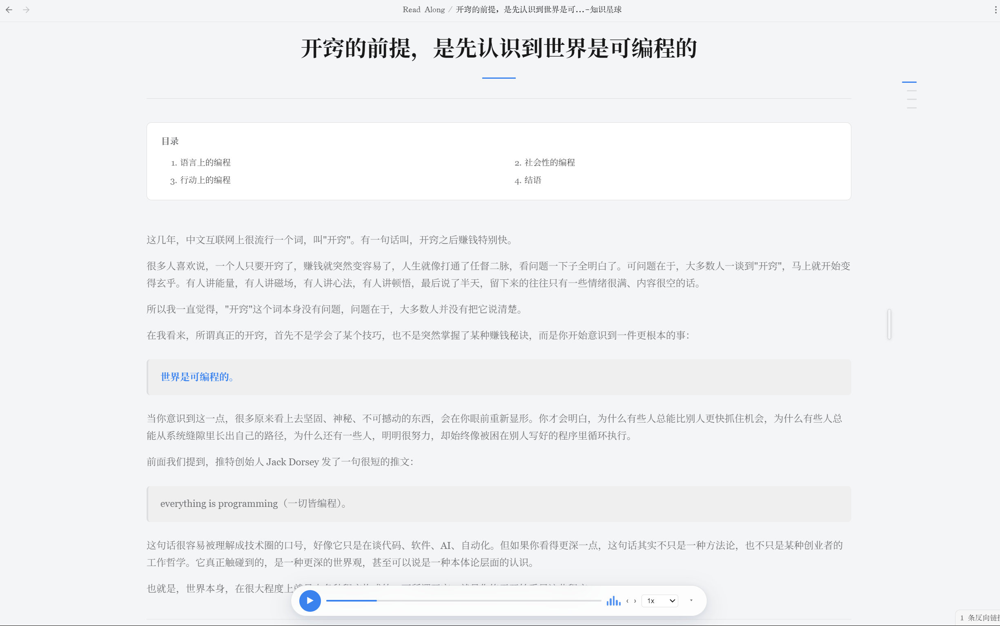
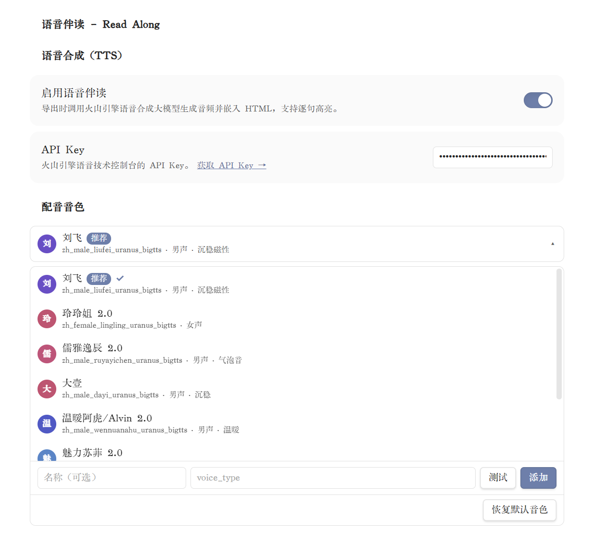

<div align="center">

# 语音伴读 · Read Along

**中文** · [English](README.en.md)

把 Markdown 笔记变成「边听边读」逐句朗读、读到哪句高亮哪句的网页。


</div>

---

> **In English:** Read Along is an Obsidian plugin that exports notes into clean, offline-readable HTML pages, with an optional "read along" mode — sentence-by-sentence TTS narration that highlights the current sentence as it plays. Full English documentation: **[README.en.md](README.en.md)**.

## 简介

**语音伴读 (Read Along)** 是一个 Obsidian 插件，希望可以帮您更快的集中注意力**专注阅读**：把拥挤的 Markdown 笔记变成像文章、报告、小册子一样舒服的阅读页；在此之上再加「**语音伴读**」——调用 TTS 把全文**逐句朗读**，**读到哪句高亮哪句**，配一个内置悬浮播放器（播放 / 暂停 / 倍速 / 上一句 · 下一句 / 进度条），让长文可以**边听边读**。

导出的 `.html` 完全自包含（内联 CSS、可选内嵌图片与音频），读取时不依赖任何外部网络——既能直接双击在浏览器打开，也能在 Obsidian 文件列表里直接点开阅读。

**适合的场景**

- 把长笔记、调研文档、年度总结、深度文章导出成更舒服的阅读版；
- 长文「听读」：通勤、护眼，或想换种方式再过一遍内容；
- 自动生成可点击目录，在长文里快速跳转；
- 离线归档与分享：纯 CSS 与内联资源，断网也能读。

## 效果预览








## 功能特性

- **🔊 语音伴读（可选）**：逐句调用 TTS 合成语音并内嵌进导出页，配悬浮播放器（播放 / 暂停 / 倍速 / 上一句下一句 / 进度条），播放时**当前句子实时高亮**。
- **📄 自包含导出**：导出当前笔记或整个文件夹为 `.html`，内联 CSS、可选内嵌图片与音频，读取时零网络依赖。
- **📖 清爽阅读排版**：窄栏正文、衬线字体、清晰标题层级、可点击目录、表格、代码块、引用块、重点提示、结论卡片，以及 ASCII 图块。
- **🧭 应用内阅读**：注册 `.html` 阅读视图，导出页可直接在 Obsidian 文件列表里打开，无需离开知识库。
- **🔗 源笔记反向链接**：可选在源笔记顶部插入整洁的回链——即使导出路径里包含 `#` 也能正确解析。
- **🗂️ 结构与链接保留**：保留文件夹结构、把 wikilink 转换为同名 HTML 链接、把本地图片内嵌为 data URI（均可开关）。
- **🌐 中英双语界面**：菜单与设置页支持中文 / English 切换。当前版本优先支持桌面端。
- **📖 可调阅读宽度**：正文列右边缘有一根竖条把手:平时颜色贴近页面背景、只靠柔和阴影显形,下滑时隐藏、停下/上滑时出现,不打扰阅读。。

## 安装

### 手动安装

1. 从 Release 下载这两个文件：`main.js` 与 `manifest.json`。
2. 在你的 vault 中创建插件目录：

   ```text
   .obsidian/plugins/read-along/
   ```

3. 把 `main.js` 与 `manifest.json` 放进该目录。
4. 重启（或重新加载）Obsidian。
5. 在「第三方插件」中启用 **语音伴读 (Read Along)**。

## 使用

**导出当前笔记**——打开命令面板，运行：

```text
语音伴读: 导出当前笔记为语音伴读页面
```

也可以在文件列表里**右键**某个 Markdown 文件或文件夹，选择导出命令。导出文件默认保存到 `Read Along/`（可在设置里修改）。

设置页还可以调整：导出文件夹、样式预设、是否保留文件夹结构、wikilink 转换、图片内嵌、应用内 HTML 阅读、入口笔记生成、源笔记反向链接插入等。

### 开启语音伴读

1. 打开插件设置，启用 **语音合成 (TTS)**；
2. 填入你**自己的火山引擎（Volcengine）语音合成 API Key**；
3. 选择一个音色。

之后再导出，页面就会内嵌逐句音频与同步高亮。



## 隐私

HTML 导出本身**全程在本地运行**——网页转换不会上传你的任何笔记内容。

**语音伴读是唯一的例外**：开启 TTS 后，笔记的句子会用*你自己的* API Key 发送到火山引擎（Volcengine）语音合成接口，返回的音频被内嵌进导出页。只要不开启语音伴读，所有内容都不会离开你的 vault。

## 开发

```bash
npm install
npm run build
```

生产构建会把 `main.js` 输出到仓库根目录。

> **发布**：Obsidian 社区发布要求 GitHub release tag 与 `manifest.json` 里的版本号**完全一致且不带 `v` 前缀**；release 资产需分别包含 `main.js` 与 `manifest.json` 两个文件。

## 致谢与许可

本项目基于开源项目 [notes-to-html-pages](https://github.com/afanos/notes-to-html-pages)（作者 Afan，MIT 许可）二次开发，在其之上做了品牌化（语音伴读 / Read Along）与功能扩展（语音伴读、`#` 路径链接修复等）。原始版权声明保留在 `LICENSE` 中。感谢原作者。

基于 [MIT](LICENSE) 许可发布。
